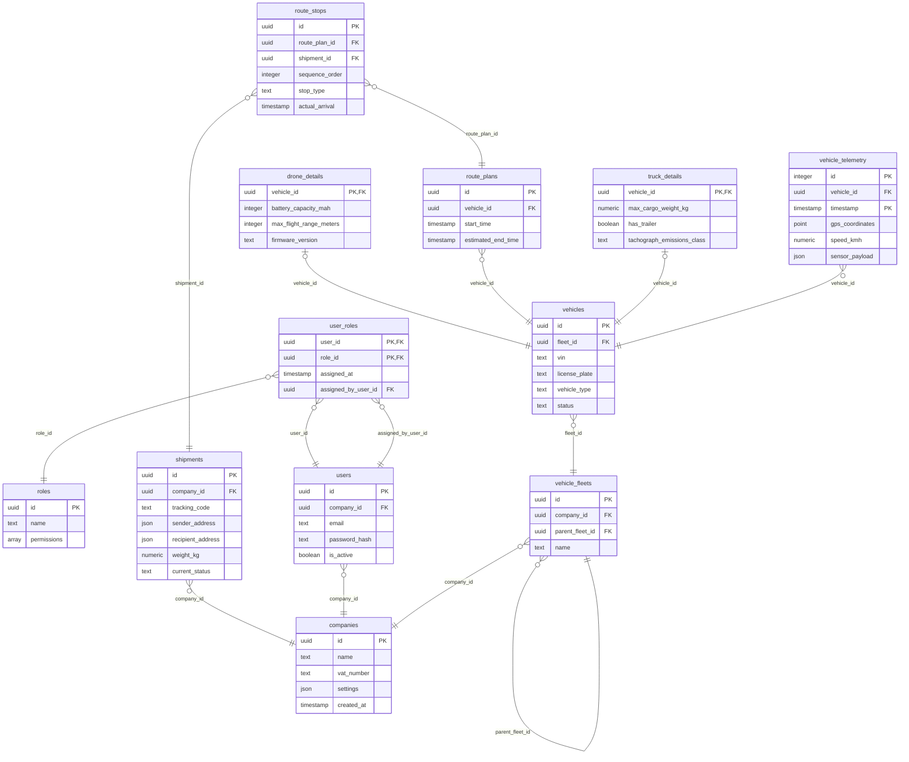

<!-- Von erd2okf generiert. Hand-Edits gehen bei der nächsten Generierung
     verloren — Semantik gehört in den Body der Tabellen-Files. -->

# postgres

| Tabelle | Beschreibung |
| --- | --- |
| [companies](./companies.md) | Zentrale Mandantentabelle. Jedes Asset und jeder User muss einer Company zugeordnet sein. |
| [drone_details](./drone_details.md) | Erweiterte Attribute, falls das Fahrzeug eine Drohne ist (1:1 Relation). |
| [roles](./roles.md) | Globale Rollenprofile mit einer Liste von Berechtigungs-Strings. |
| [route_plans](./route_plans.md) |  |
| [route_stops](./route_stops.md) | Verknüpft Routen mit Sendungen. Bestimmt die exakte Reihenfolge von Be- und Entladungen. |
| [shipments](./shipments.md) | Frachtaufträge, die von den Fahrzeugen transportiert werden. |
| [truck_details](./truck_details.md) | Erweiterte Attribute, falls das Fahrzeug ein LKW ist (1:1 Relation). |
| [user_roles](./user_roles.md) | Zuordnungstabelle für Rollen. Enthält Auditing-Metadaten, welcher User die Rolle vergeben hat. |
| [users](./users.md) | Mitarbeiter der jeweiligen Mandanten. |
| [vehicle_fleets](./vehicle_fleets.md) | Ermöglicht unendlich tief verschachtelte Flottenstrukturen pro Mandant. |
| [vehicle_telemetry](./vehicle_telemetry.md) | Massen-Telemetriedaten der Fahrzeuge. Extrem hohe Schreiblast. |
| [vehicles](./vehicles.md) | Stammdaten für Fahrzeuge aller Art. Der Typ bestimmt, welche Sub-Details existieren. |

## ERD

